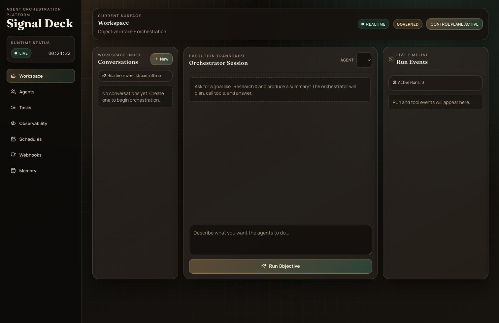
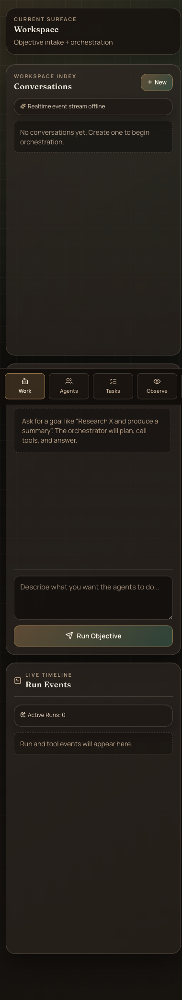
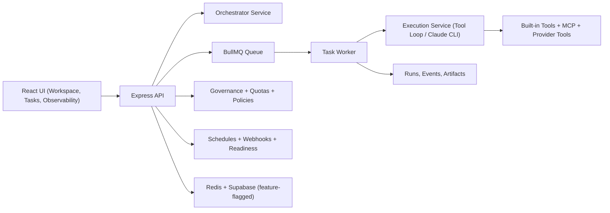

# Signal Deck

Open-source AI execution control plane for teams.

Signal Deck turns a plain-language objective into a planned, observable, governable execution run:

1. Capture objective in a chat-first workspace.
2. Plan work as sequential, parallel, or DAG steps.
3. Execute through agent runtimes and tools.
4. Gate risky actions with approvals.
5. Track runs with timelines, artifacts, and reliability signals.




## Why this project exists

Most AI apps can answer questions, but struggle to run real work reliably.
Signal Deck is built for objective-to-outcome execution with production-minded controls:

- Orchestration, not just chat
- Queue-backed execution
- Run/event observability
- Governance and quotas
- Scheduling, webhooks, and integrations

## What it does today

- Chat-first objective submission from Workspace UI
- Multi-step orchestration (`sequential`, `parallel`, `dag`)
- Tool-loop and Claude CLI execution modes
- Run timeline events + run intelligence summaries
- Governance approvals for risky tool calls
- Rate limiting, circuit breakers, dead-letter queue
- Schedule automation and webhook triggers/deliveries
- Workspace-scoped quotas and policy snapshots
- Feature-flagged Supabase persistence/auth integration

## High-level architecture



## Quickstart

### 1. Prerequisites

- Node.js 20+
- npm
- Redis (recommended for full runtime behavior)

### 2. Start the server

```bash
cd server
npm install
npm run dev
```

Server default: `http://localhost:3001`

### 3. Start the client

```bash
cd client
npm install
npm run dev
```

Client default: `http://localhost:5173`

### 4. Open the app

1. Deploy an agent in `Agents`
2. Create a conversation in `Workspace`
3. Submit an objective
4. Watch execution and events in real time

## Core APIs

- `POST /api/conversations/:conversationId/messages` - start an objective run
- `POST /api/tasks` - queue direct tasks
- `POST /api/plans` - create/start orchestration plans
- `POST /api/plans/dag` - create/start DAG plans
- `GET /api/runs/:runId/intelligence` - grouped run phase insights
- `GET /api/runs/:runId/artifacts` - sources/evaluation/approvals artifacts
- `GET /api/system/readiness/review` - staged rollout gates
- `GET /api/system/openapi.json` - OpenAPI spec

## Feature flags (important)

This repo ships with staged rollout flags. High-impact flags include:

- `FEATURE_DEEP_RESEARCH`
- `FEATURE_MCP_SDK_CLIENT`
- `FEATURE_PROVIDER_TOOLS`
- `FEATURE_EVALUATOR_LOOP`
- `FEATURE_APPROVAL_GATES`
- `FEATURE_HTTP_RATE_LIMIT`
- `FEATURE_CIRCUIT_BREAKERS`
- `FEATURE_DEAD_LETTER_QUEUE`
- `FEATURE_ADVANCED_DAG`
- `FEATURE_DYNAMIC_AGENT_POOLS`

Environment details: `server/docs/ENVIRONMENT_CONTRACT.md`

## Product direction

Signal Deck is now focused on one north-star outcome:

**Objective -> deterministic plan -> governed execution -> verifiable result**

## Design System Upgrade Plan

Signal Deck UI is being upgraded to an **Industrial Editorial** visual system so the product reads like a production control plane instead of a generic dashboard.

### V1 rollout scope

- App shell (left navigation rail + command-focused top bar + mobile bottom rail)
- Workspace surface (`Conversations`, `Orchestrator Session`, `Run Events`)
- Tasks surface (`Queue overview`, filtering, operational task cards)

### Guiding principles

- Hierarchy first: typography and layout should immediately communicate priority.
- Signal clarity: status, risk, and runtime state must be scannable at a glance.
- Motion restraint: one orchestrated page-load reveal plus purposeful interaction transitions.
- System consistency: shared tokens and style contracts, not one-off component styling.

### Contribution guardrails

- Use token-driven styling from `client/src/index.css` (`--color-*`, `--space-*`, `--radius-*`, `--shadow-*`, `--motion-*`).
- Avoid generic UI defaults (for example: default font stacks, purple-on-white gradients, interchangeable card grids).
- Do not introduce ad-hoc visual constants when an existing token or utility class can be reused.
- Maintain keyboard accessibility, visible focus states, and reduced-motion behavior.

### Acceptance checklist

- Shell, Workspace, and Tasks render with one coherent visual language.
- Status semantics are readable in both compact and expanded task/workspace states.
- Desktop and mobile layouts remain usable without overflow regressions.
- No backend contract changes and no functional regressions in core workflows.

Future deep-dive docs can be added under `docs/` as this system expands to remaining tabs.

Roadmap: `ROADMAP.md`  
Product vision: `docs/PRODUCT_DIRECTION.md`  
Architecture details: `docs/ARCHITECTURE.md`  
Docs index: `docs/README.md`

## Contributing

See `CONTRIBUTING.md` for setup, standards, and contribution flow.
All code changes must go through Pull Requests; direct pushes to `main` are blocked by branch protection.

## Project policies

- `LICENSE`
- `SECURITY.md`
- `CODE_OF_CONDUCT.md`
